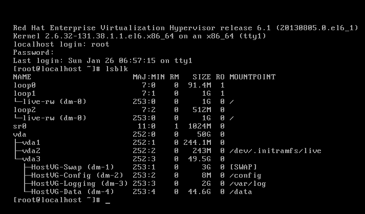
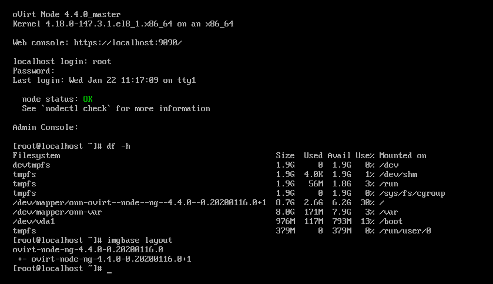
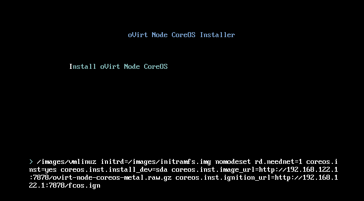
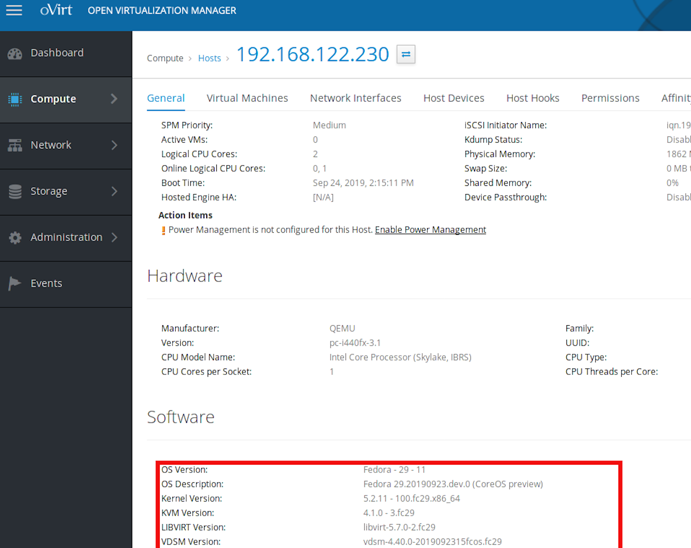
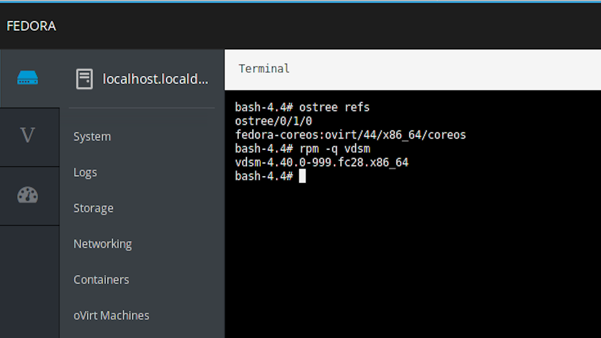

# Reigniting oVirt Node

Yuval Turgeman, Red Hat <!-- .element: style="position: absolute; left: 0; top: 100%; font-size: 0.6em" -->
yuvalt@redhat.com <!-- .element: style="position: absolute; left: 0; top: 120%; font-size: 0.6em" -->

note:
- The reincarnation of ovirt node as a layered product of fedora-coreos

---

# Agenda
- Background
- Evolution
- Build/Deploy CoreOS Node
- Challenges

note:
- Background - what's ovirt, and more specifically ovirt node and why we need it
- Evolution - where we were a few years ago, what we're doing today and what we have in mind for the future
- Explain how we built our own coreos-based node using the standard tools from coreos, and how we can deploy it
- and then discuss the challanges we hit

---

# Background
- What's an oVirt Node
- Legacy node
- NG node
- CoreOS node

note:
- What's ovirt? the leading open source virtualization plaform
- An ovirt host (or hypervisor) is where vms actually run so for that we need the ovirt bits (vdsm, gluster) and virt stack (libvirt, qemu)
- Turning a host to an ovirt host is just enabling the ovirt repos (ovirt-release) and install ovirt-host
- Ovirt node is a minimal installation that already includes the required ovirt bits
- DIfferent layouts, legacy 3x, ng 4x, coreos

---

# Legacy Node

- LiveCD - mounted R/O ISO, with live-rw and persistant state
- Image based, immutable OS, based on Fedora/CentOS/RHEL <!-- .element: class="fragment" data-fragment-index="1" -->
- Maintenance, custom installer, whitelisting files, live-rw <!-- .element: class="fragment" data-fragment-index="2" -->

note:
- Drawbacks - live-rw would obvirously be deleted which is something you dont really expect for an installed system.

--

---

# NG Node
- LVM - R/O volume with mounted R/W snapshot on top
- Image based, A/B updates, based on Fedora/CentOS/RHEL <!-- .element: class="fragment" data-fragment-index="1" -->
- Upgrade flow maintenance (imgbased), delivery with yum/dnf <!-- .element: class="fragment" data-fragment-index="2" -->

note:
- Based on LVM and snapshots, we compose a squashfs and deliver it inside an rpm using yum/dnf.
- The squashfs is extracted into an LV which is then marked as R/O, and then we create a snapshot which is mounted r/w as / while /var is common.
- A new boot entry is added, and selected by default, so if something didnt work you can just boot to the previous working version
- Benefits - image based, A/B updates, it just works...
- Drawbacks - making it just work is hard
- zstream updates are very challenging
- we can't simply run the rpm scriplets and expect them to work because rpm will not detect this as upgrade
- Since we're using yum/dnf we need to mark the system as updated by using some hacks with on the rpmdb

--

note:
- Minimal installation (no extra NIST partitioning), requires ~15-20G

---

# CoreOS Node
- Motivation
- rpm-ostree vs imgbased
- Large community (CoreOS, Silverblue, Atomic)

note:
- Motivation, first of all, it's cool, so why not ?
- CoreOS/Atomic/rpm-ostree try to solve the same problems as what we're trying to solve:
- image-based deployment with the ability to do rollbacks to the entire image.
- rpm-ostree is more modern and tries to be a generic solution while imgbased became over the years a little more tightly coupled with ovirt
- example (vdsm service)
- Large community

---

# Build/Install
- Coreos-assembler + configuration repository
- Basic config with fedora-coreos-config.git
- Extract ovirt-release rpm
- Artifacts: rpm-ostree commit and raw metal installer
- Installing just like a normal Fedora-CoreOS

note:
- In order to compose our own coreos based node, we wanted to use the standard tools from coreos.
- For this purpose we used the coreos-assembler (cosa) container.
- Basically, we run the container with a git repository that holds several configuration files, and we call the commands we need (build, buildextend-metal)
- clone the fedora-coreos-config git repository
- update our manifets (set commit refs, package list)
- grab ovirt-release rpm, install and enable ovirt repos
- run coreos-container with a raw metal installer
- artifacts are a thin iso, a raw image, and an ostree commit
- Installing...

--

--

--

---

# Challenges
- Kdump support
- Managing users and groups (systemd-sysusers) <!-- .element: class="fragment" data-fragment-index="1" -->
- Podman/docker <!-- .element: class="fragment" data-fragment-index="2" -->
- Ignition versioning <!-- .element: class="fragment" data-fragment-index="3" -->
- rpm-ostree (selinux scriplets, permissions) <!-- .element: class="fragment" data-fragment-index="4" -->

note:
- LASTLY - Moving fast

---

# Open Issues
- Non-standard paths <!-- .element: class="fragment" data-fragment-index="1" -->
- Controlling kernel arguments <!-- .element: class="fragment" data-fragment-index="2" -->
- Ansible module for rpm-ostree <!-- .element: class="fragment" data-fragment-index="3" -->

note: 
- Rebuilding vdsm with a custom path /var/run, but we need a hook for qemu
- kernel arguments - ovirt uses grubby, but with an ostree-based system we need to use rpm-ostree
- Ansible module requires a reboot after installing a new package - collaborating with the coreos team, trying to solve this

---

# Questions ?

