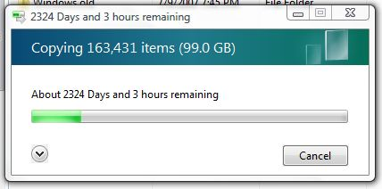
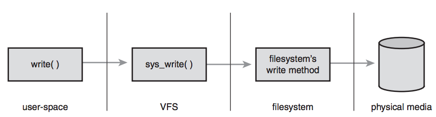

# Filesystems in userspace

Yuval Turgeman, Red Hat <!-- .element: style="position: absolute; left: 0; top: 100%; font-size: 0.6em" -->
yuvalt@gmail.com <!-- .element: style="position: absolute; left: 0; top: 120%; font-size: 0.6em" -->

---

# Agenda
* Filesystems overview
* Hello world
* oVirt filesystem

note: how filesystems work, the differences between traditional filesystem
      implemented in the kernel and filesystems in userspace (fuse) - yes
      it's possible and quite easy with python

---

# Filesystems
- What ? Why ?

--



--

# Filesystems
- Interface to physical media
- Virtual filesystems <!-- .element: class="fragment" data-fragment-index="1" -->
- Represent and control state <!-- .element: class="fragment" data-fragment-index="2" -->
- Implement a common interface (open, read, write) <!-- .element: class="fragment" data-fragment-index="3" -->
- Use standard tools (ls, cat, shell redirection) <!-- .element: class="fragment" data-fragment-index="4" -->

note: Developer uses an API, but any user can use a filesystem

---

# How does it work ?
- Virtual File System (VFS) - an abstract layer for all filesystems <!-- .element: class="fragment" data-fragment-index="1" -->
- Kernel module registers the FS in the VFS <!-- .element: class="fragment" data-fragment-index="2" -->

--

* Traditional in-kernel filesystem



---

# FUSE
- A kernel module that registers fuse in VFS <!-- .element: class="fragment" data-fragment-index="1" -->
- A userspace library and daemon <!-- .element: class="fragment" data-fragment-index="2" -->
- No kernel knowledge, super simple, highly adopted <!-- .element: class="fragment" data-fragment-index="3" -->

note: A daemon that runs in the background listening to filesystem requests
      (open, read, write) on relative paths, over /dev/fuse

--


---

# Python

---

# Hello World
```python
import fuse

fuse.fuse_python_api = (0, 2)

class PyConFS(fuse.Fuse): pass 

if __name__ == '__main__':
    server = PyConFS()
    server.parse()
    server.main()
```

note: [1] run python2 0_emptyfs.py
      [2] show mount point and process
      [3] discuss client-server architecture

--

* getattr() - get file attributes, similar to stat

```python
import stat

class PyConFS(fuse.Fuse):
    def getattr(self, path):
        print("Received path [%s]" % path)
        if path == "/":
            return fuse.Stat(st_mode=stat.S_IFDIR | 0o755,
                             st_nlink=1)
```

--

```python
class PyConFS(fuse.Fuse):
    _PATH = "/hello_pycon19"
    _DATA = "PyCon rocks \m/\n"

    def getattr(self, path):
        print("getattr({})".format(path))
        if path == "/":
            return fuse.Stat(st_mode=stat.S_IFDIR | 0o755,
                             st_nlink=1)
        if path == self._PATH:
            return fuse.Stat(st_mode=stat.S_IFREG | 0o600,
                             st_size=len(self._DATA),
                             st_nlink=1)
        return -errno.ENOENT
```

note: play with file permissions

--

* readdir() - list directory content

```python
class PyConFS(fuse.Fuse):
    _PATH = "/hello_pycon19"

    def readdir(self, path, offset):
        print("readdir({}, {})".format(path, offset))
        if path == "/":
            for r in (".", "..", self._PATH[1:]):
                yield fuse.Direntry(r)
```

--

* read() - read file content                                

```python
class PyConFS(fuse.Fuse):
    _PATH = "/hello_pycon19"
    _DATA = "PyCon rocks \m/\n"

    def read(self, path, size, offset):
        if path != self._PATH:
            return -errno.ENOENT
        data_size = len(self._DATA)
        if offset < data_size:
            if offset + size > data_size:
                size = data_size - offset
            return self._DATA[offset:offset+size]
        return ""
```

---

# Operations

- open <!-- .element: class="fragment" data-fragment-index="1" -->
- write <!-- .element: class="fragment" data-fragment-index="2" -->
- truncate <!-- .element: class="fragment" data-fragment-index="3" -->
- flush <!-- .element: class="fragment" data-fragment-index="4" -->
- ... and more <!-- .element: class="fragment" data-fragment-index="5" -->

---

# Mounting
- Modular mount <!-- .element: class="fragment" data-fragment-index="1" -->
- Mount options <!-- .element: class="fragment" data-fragment-index="2" -->

---

# oVirt + FUSE
* oVirt is the open virtualization software <!-- .element: class="fragment" data-fragment-index="1" -->
* Provides a python API to access the oVirt Manager <!-- .element: class="fragment" data-fragment-index="2" -->
* oVirtFS uses FUSE to provide a filesystem access <!-- .element: class="fragment" data-fragment-index="3" -->
* Demo <!-- .element: class="fragment" data-fragment-index="4" -->

---

# Questions ?
